# Frontend — Interface Web do Sistema Águia

## Visão Geral

A interface web do Sistema Águia foi desenvolvida para ser o ponto de acesso de **profissionais de saúde e gestores** da rede municipal de Manaus à informação integrada do SUS. O design prioriza clareza, responsividade e tomada de decisão ágil.

---

## Stack Frontend

| Tecnologia | Uso |
|-----------|-----|
| **Blade (Laravel)** | Motor de templates SSR (*Server-Side Rendering*) |
| **Tailwind CSS** | Estilização utilitária e responsividade |
| **Vite** | Compilação e *hot reload* de assets |
| **Chart.js** | Gráficos interativos (barras, radar, linha, pizza) |
| **DataTables** | Listagens nominais com paginação, busca e exportação |
| **Alpine.js** | Micro-interatividade sem overhead de framework |

---

## Princípios de UX Adotados

1. **Alertas colorimétricos**: vermelho para situações críticas (ex: NPN < 5), amarelo para atenção, verde para adequado — comunicação visual imediata sem necessidade de leitura numérica
2. **Listagens nominais**: dados individualizados por gestante, mulher ou paciente, com filtros por unidade, distrito e período
3. **Dashboards gerenciais**: painéis agregados por CNES, Distrito Sanitário e município para gestores
4. **Responsividade**: interface funcional em desktop e tablet (uso em reuniões de equipe)
5. **Acesso modular**: cada usuário vê apenas os módulos aos quais tem permissão, reduzindo sobrecarga cognitiva

---

## Mapa de Módulos

```
Sistema Águia
├── Módulo Gestante / NPN
│   ├── Painel Individual (por gestante)
│   ├── Painel Gerencial (por CNES/Distrito)
│   ├── Monitoramento de Sífilis Gestacional
│   └── Rastreio de Inconsistências Cadastrais
├── Módulo OMMA
│   ├── Painel de Exames Citopatológicos
│   ├── Painel de Óbitos (SISCAN × SIM)
│   └── Módulo Ampulheta (tempo coleta-laudo)
├── Módulo Monitor APS
│   ├── Indicadores de Performance por CNES
│   ├── Histórico de Escores
│   └── Indicadores de Cofinanciamento (PREVINE Brasil)
├── Módulo Vigilância de Óbitos
│   ├── Lista Nominal (SIM × e-SUS)
│   └── Painel de Inconsistências por Distrito
└── Módulo Vigi Manaus
    ├── Painel de Tuberculose
    └── Estatísticas SINAN / CID-CIAP
```

---

## Documentação por Módulo

- [Gestante / NPN](modulos/gestante_npn.md) — Monitoramento pré-natal com Score NPN 0-9
- [OMMA](modulos/omma.md) — Observatório da Mulher Manauara
- [Monitor APS](modulos/monitor_aps.md) — Indicadores de Atenção Primária
- [Vigilância de Óbitos](modulos/vigilancia_obitos.md) — Integração SIM × e-SUS PEC
- [Vigi Manaus](modulos/vigi_manaus.md) — Vigilância epidemiológica

---

## Fluxos de Navegação

- [Fluxo geral de navegação](fluxos/navegacao.md) — Acesso, autenticação, navegação entre módulos

---

## Segurança na Interface

O acesso é protegido por três camadas visíveis ao usuário:
1. **Login com 2FA** (código TOTP via aplicativo autenticador)
2. **Aceite obrigatório da LGPD** (antes do primeiro acesso aos dados)
3. **Controle modular** (usuário vê apenas módulos autorizados)

---

## Telas do Sistema Águia

### 1. Módulos Águia
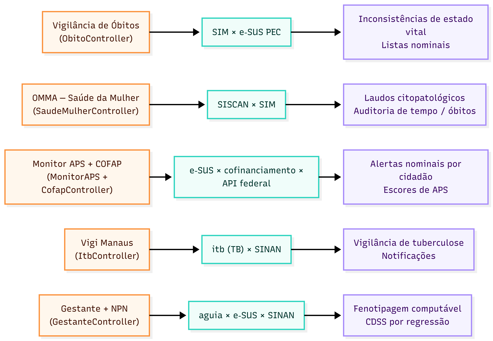

### 2. Fluxo de Entrada - Login


### 3. Tela Principal
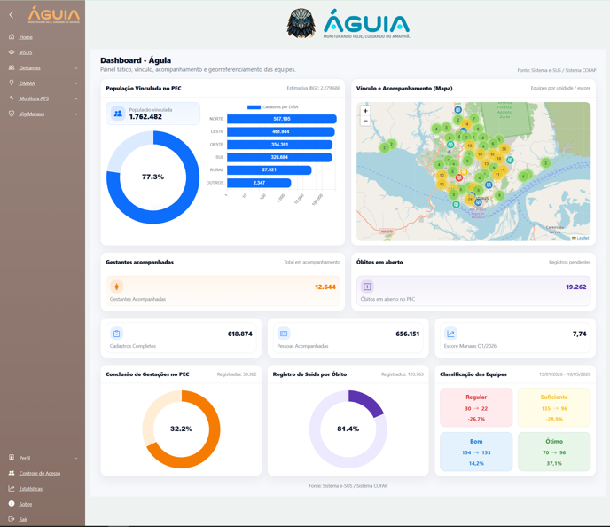

### 4. Consulta de Gestantes
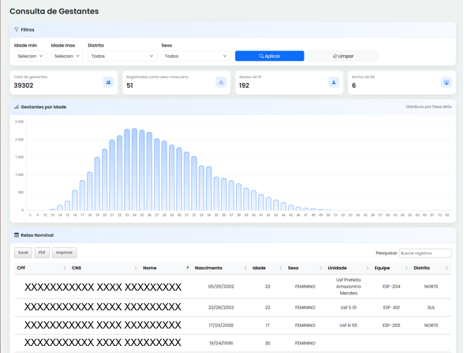

### 5. Acompanhamento de Gestantes (Sífilis)
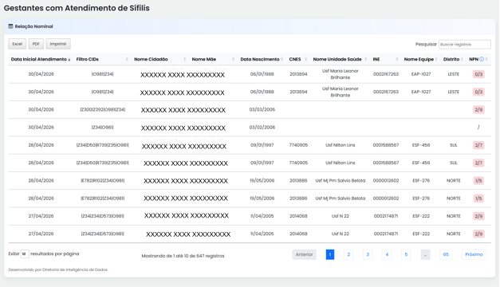

### 6. Aplicação - Sífilis na Gestante
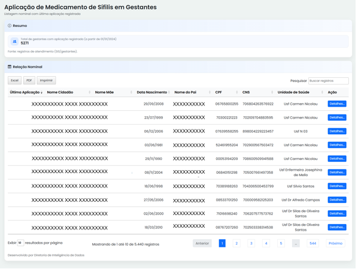

### 7. Gestações em Aberto
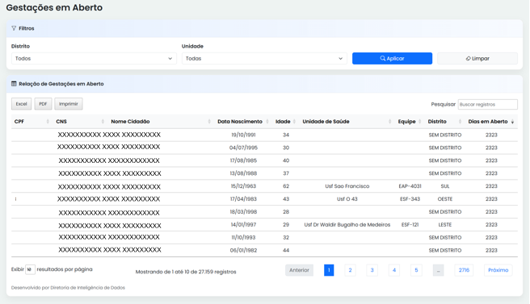

### 8. Busca Ativa NPN
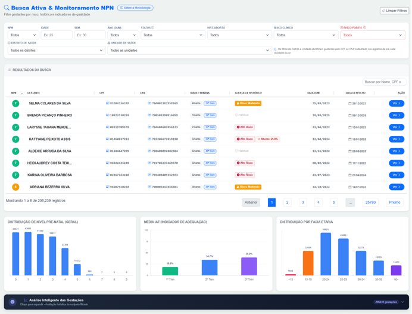

### 9. OMMA (Observatório da Mulher Manauara)
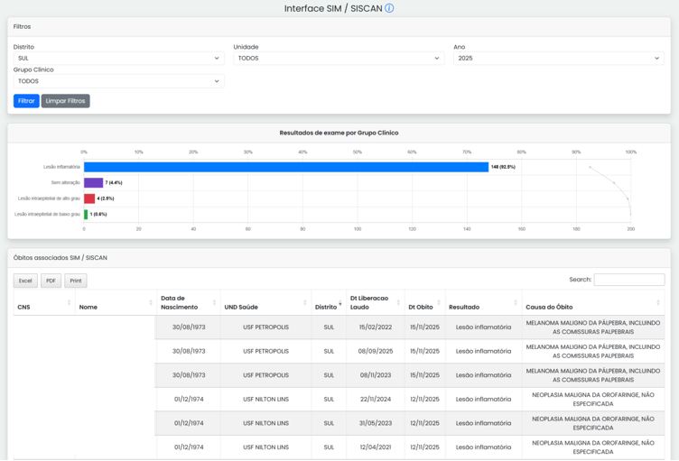

### 10. OMMA - Exames Citopatológicos por Faixa Etária
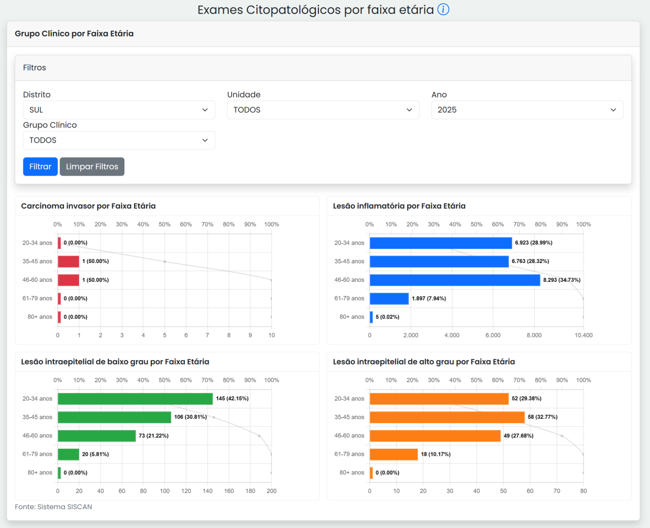

### 11. OMMA - Ampulheta
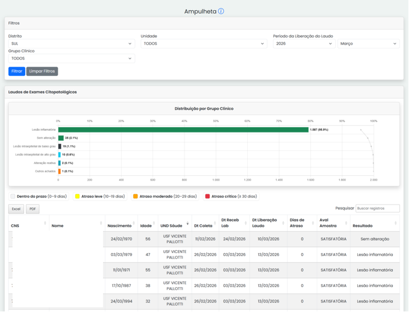

### 12. Raio-X ITB
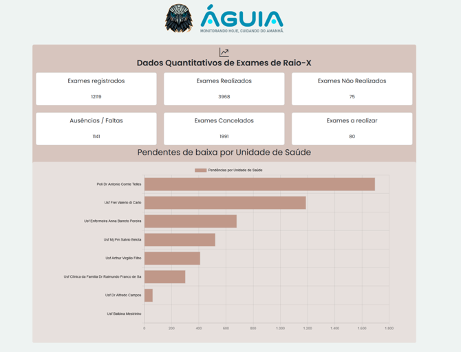

### 13. Óbito - Prontuários em Aberto
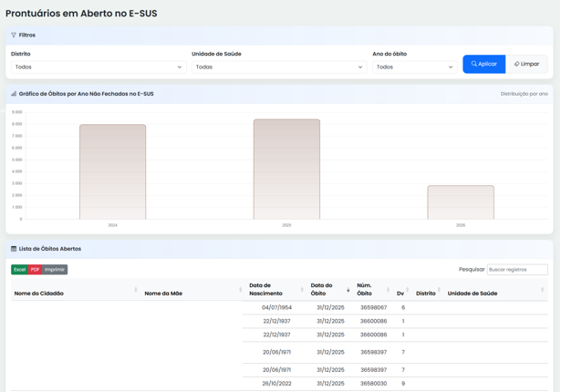

### 14. Óbito - Atendimento Pós-Óbito
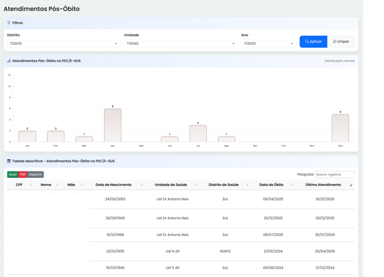

### 15. Registros de Notificação SIM (CID)
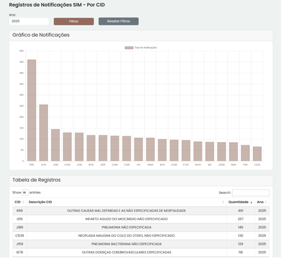

### 16. Registros de Notificação SIM (Grupo)
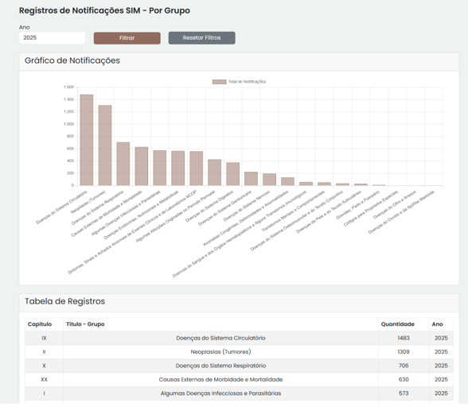
